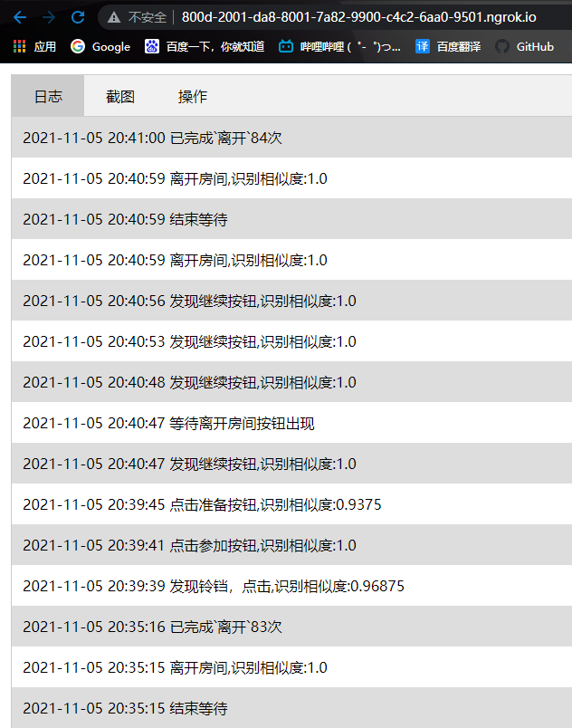
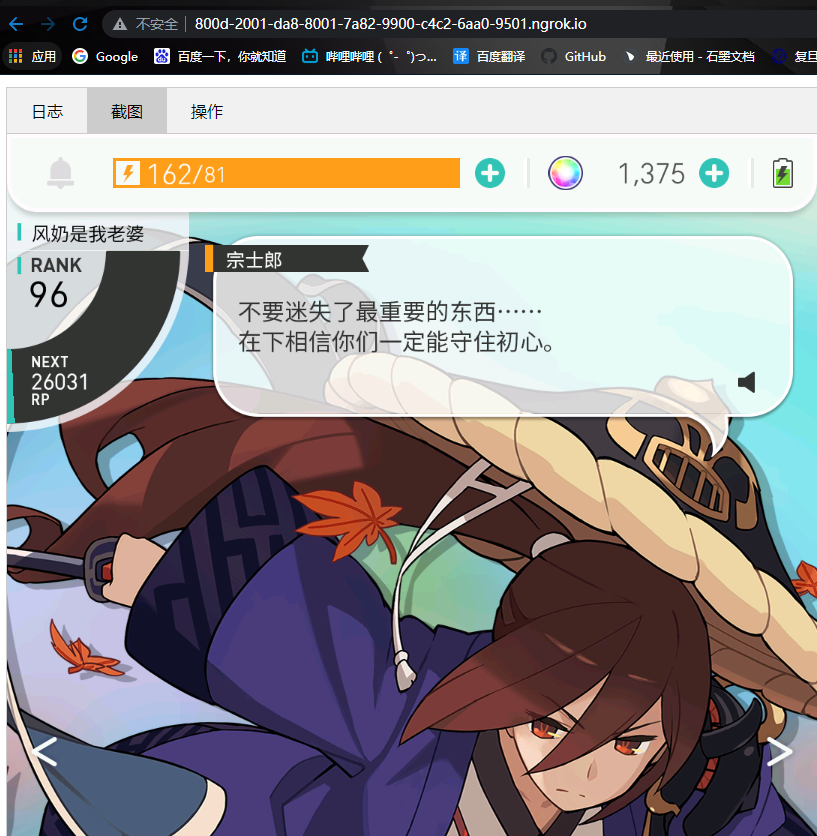
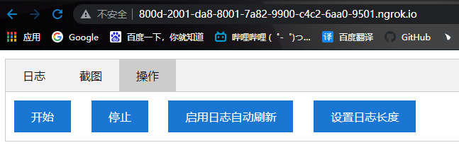

# WFHelper

     

世界弹射物语护肝宝，24小时自动混铃铛共斗

该项目最初源于一个简易的世界弹射物语自动铃铛脚本，现已逐步拓展功能，成为安卓平台通用的自动化脚本框架。

## 由于作者时间有限，不保证以下Readme随时保持最新，欢迎加群咨询！！！

## Feature

> + 轻量级项目，无需复杂CV库和深度学习库
> + 低开销，图片比对基于pHash匹配，有效提高运行效率，减少计算
> + 兼具高精度和容错率
> + 模块化，独立出config以便适配任何分辨率以及其他不同游戏，极具灵活性
> + 远程控制，提供web后台进行脚本的远程操作

## Usage

### 对于小白

请直接去Release下载最新版本版本，打包好了exe，可以开箱即用。

### 运行环境配置

> 1. 安装配置python3.9环境
> 2. `pip install pipenv`安装pipenv
> 3. 使用`pipenv`安装依赖`pipenv install`
> 4. 下载`main`分支下的源码以保持功能稳定且较新

### 配置文件

配置文件是整个项目的核心，为项目赋予了灵魂，拒绝hard coding。由于该项目泛用性较差，针对分辨率不同的设备，需要为其单独准备配置文件，目前项目中提供了一些现成的配置文件，分别是1440x810分辨率dpi270的模拟器配置，以及蓝叠1280x720分辨率dpi270的模拟器配置，还有一套用于一加9R的明日方舟循环刷图配置，可以开箱即用，但是不保证100%能用，遇到问题请看完Readme自行解决，也可加群咨询；如果想要在其他分辨率或为其他游戏制作配置文件，可以参考`自定义配置文件`

#### 使用已有配置文件

以MUMU手游助手为例：
> 1. 设置模拟器分辨率为1440x810
> 2. 使用`adb connect 127.0.0.1:7555`连接模拟器
> 3. 使用`python \main.py -d 127.0.0.1:7555 -c configs\emulator1440x810\config.json`运行脚本

#### 自定义配置文件

参考给定的两个配置文件目录`emulator1440x810`和`bluestack1280x720`，将其中的截图替换为自己设备的对应的截图，具体来说
> 1. 首先使用`adb`连接自己的设备
> 2. 使用命令`python .\main.py -s path\of\picture.png`进行截图
> 3. 完成截图后在截图所在目录下新建`config.json`文件，关于`config`文件的格式请参考`配置文件格式`
> 4. 需要注意config文件必须和截图文件放在同一目录下

#### 配置文件格式

配置文件包含截图文件和一个`json`文件。截图文件是你想要脚本去进行图片比对的游戏界面的截图，不多赘述。

对于`json`文件，项目中提供了`config_demo.json`作为样例，用于解释`config.json`文件的作用以及其格式。
由`config_demo.json`可以知道，一个配置文件被分为了全局字段和targets两个部分

目前全局字段为非强制填写，均可省略，但是尽量不要省略以免出现意料之外的错误，部分字段带有默认值，现有的全局字段如下:
> + `name`:字符串，配置文件的名称，在加载时将被打印出来
> + `author`:字符串，配置文件作者的名称，在加载时将被打印出来
> + `description`:字符串，配置文件描述的描述信息，用于介绍配置文件的使用方法和功能，在加载时将被打印出来
> + `similarityThreshold`:浮点数，脚本运行时，进行图片识别的相似度阈值，取值范围为0~1，阈值越高代表两张图片要足够相似才能被识别，默认值为1
> + `randomClickDelay`:浮点数，脚本运行时若长时间未进行任何操作，会随机点击屏幕，该值为"长时间"的具体值，单位为秒
> + `randomClickArea`:四维向量，长时间无操作时随机点击的范围，前两维为左上角坐标x,y，后两维为右下角坐标x,y，默认值为[0,0,1,1]即屏幕左上角
> + `screenSize`:二维向量，屏幕分辨率，如1440x810则为[1440,810]，暂时无功能
> + `loopDelay`:浮点数，每一轮图片比对之间的间隔时间
> + `targetList`:字符串数组，规定配置文件中有哪些target组，必须要有一个`mainTargets`组否则无法运行
> + `mainTargets`:脚本默认会在这个目标组里查找图片，详细介绍见下文，可定义其他的目标组

`mainTargets`代表这个你想要脚本进行识别的对象，它是一个数组，数组中存放的是一个个的`target`，`target`是一个对象，它有以下字段:
> + `name`:字符串，`target`的名称，不可省略，用于区分不同`target`
> + `path`:字符串，`target`存在的截图的文件名，不可省略，只要文件名即可，不支持任何形式的路径
> + `area`:四维向量，`target`在截图文件中的具体位置，不可省略
> + `similarityThreshold`:浮点数，相似度阈值，可以省略，只对单个`target`有效，未指定时适用全局相似度，否则适用指定相似度
> + `colorRatio`:浮点数0~1，默认为0，代表使用图片比对时的颜色占比，通常情况下最好不要使用，遇到两张图片除了颜色不同但形状相似导致的误识别时可以适当提高该值，来增加颜色对识别影响的比重
> + `text`:字符串，识别到`target`时打印的信息，暂时不可省略
> + `description`:字符串，介绍该`target`功能，目前未实装功能，可以忽略
> + `actions`:对象数组，数组中存放的是一个个`action`对象，识别到`target`时会执行的`action`，如点击，统计等，`action`对象之间存在先后顺序

其中`action`对象的存在是脚本能够进行复杂操作的基础，可以在源码中预设不同的`action`类型来完成不同操作，并通过`action`的组合来达到无需修改源码也能实现一些相对难以实现的操作的效果，相当于API调用。这一部分在后期开放迭代过程中可能会频繁改动。

`action`对象的字段如下:
> + `name`:字符串，`action`的名称，也即`action`的类型，不可省略，目前预设的类型及其介绍在下文能够找到
> + `args`:数组，`action`的参数，不同`action`的参数不同，有些可以省略

`action`类型及说明如下:
> + `click`:在指定范围内的随机位置点击一次，接受一个四维数组作为参数；当不指定参数时，默认点击的位置为该`action`附属的`target`的`area`范围
> + `sleep`:等待指定时间，接受一位浮点数作为参数且不可省略，单位为秒
> + `state`:能够操作全局变量，接受三个参数，参数一为操作方法`set`或`increace`，参数二为全局变量名，可自定义，参数三为操作数
> + `changeTarget`:去指定的子目标组进行一次目标匹配，并执行动作，参数一为指定的目标组名称，参数二为`once`时，只去指定目标组进行一轮匹配，参数二为`loop`时，将永久替换当前检测的目标组，参数二可以省略，默认为`once`
> + `info`:打印信息，打印参数一，并将剩余参数作为参数一的format输入，不会用就填一个参数就行了
> + `exit`:停止脚本，无参数

`config`文件设计的初衷就是将该项目的定位由某个特定游戏的脚本上升至通用的脚本框架，其诸多好处想必无需赘述

### 运行脚本

对于1440*810的模拟器，完成运行环境配置后并连接`adb`后输入`python .\main.py`即可开始挂机。另外本项目即将提供web前端控制界面，目前处于实验阶段，开放端口8080作为服务器端口，可以通过 http://你的电脑ip:8080 访问后台，有简单的UI可以查看日志、截图（可以点击，有间隔）和部分操作。（感谢@snyssss提供的前端页面）

#### 参数说明

脚本提供了一些可配置的参数设置：
> 1. 当连接多个设备时使用`-d`参数来指定设备名称，设备名称可以通过`adb devices`获取，如`python .\main.py -d 127.0.0.1:7555`
> 2. 想要使用不同配置文件时，可以用`-c`参数指定配置文件路径，如`python .\main.py -c configs\emulator1440x810\config.json`，若不指定配置文件，默认的配置文件为`configs\emulator1440x810\config.json`，可以在`Config.py`中修改默认值
> 3. 本工具提供了截图功能，使用`-s`参数可以进行截图并直接保存到电脑，如`python .\main.py -s C:\Users\Admin\Desktop\test.png`

## 已知问题

使用过程中有任何问题欢迎提issue或者加群反馈！！！

### 某某图片/按钮无法识别的问题

经过测试，即使是相同的模拟器，在不同电脑上进行截图也会产生较大的颜色差距，目前主要集中在无法识别准备按钮，遇到这种情况自行截图并替换对应图片，或者调低相似度阈值即可。

### 不同设备截图

该项目截图使用`adb shell screencap -p`并直接读取输出的二进制数据，但是发现直接读到的数据由于回车符的存在而无法直接被识别为图片，因此需要进行替换，对于一加9R，替换方式为将`\r\n`替换为`\n`，而对于模拟器替换方式则是`\r\r\n`替换为`\n`，不清楚会不会有其他的情况存在，所以目前的解决办法是两种都试试，如果出现某个设备截图保存下来的图片格式错误那么可能是这里的问题，欢迎提issue。

### MUMU卡死

By snyssss：本人自用win11 64位系统下使用MUMU会出现图片内存释放不了，导致占用变高造成卡死的情况，所以写了蓝叠版的配置文件，可以尝试使用。目前配置为蓝叠中国64位，1280*720，DPI240。

## 效果如图

## TODOS

目前还有一些非常有趣的功能处于构思阶段，但无奈本人时间确实有限，因此将其真正实现还需要更多时间，在此感谢各位大佬的pr，也欢迎更多新的大佬加入进来。之后的工作主要会集中在以下几个我认为比较重要的点来进行，按照优先级来排序如下：

### 多开以及前端改版

目前脚本的主线程为自动脚本的主循环，而子线程为后端服务器，虽然能够实现多开，但是无法实现同一个后台服务器管理多个脚本的功能，多个脚本之间无法进行数据传递。我的构想是脚本执行后只开启后台服务器，而用户可以在前端页面进行设备连接、配置文件选择以及脚本的开始和停止。在前端页面中，可以打开新的tab来创建新的WFHelper实例来连接多个设备，并且能够在不同实例间通过同一个后台服务器来进行数据交换。原有的参数方式启动脚本也应该依然被支持，且会提供是否开启后台服务器的参数选项。前端页面还将具备创建配置文件的功能，能够方便的在前端进行截图和坐标选取，并有合适的UI用于选择action和填写参数等。最后在加个target的识别状态和action的执行状态的可视化，perfect！

### 截图太慢
基于`adb shell screencap -p`的截图由于其速度非常慢一直被人诟病，之后有时间会研究scrcpy的源码并将其集成至该项目。最好能直接实现一个scrcpy的网页版。

### 材料统计

不同于一般的target的，结算界面的材料一般来说出现的位置和数量都是不固定的，因此在现有的框架中难以进行匹配和统计，可能需要引入其他图片比对的方法。目前没有深入考虑。

## QQ群

欢迎来开车和踢罐，马上出超本了，护好您的肝！！！

