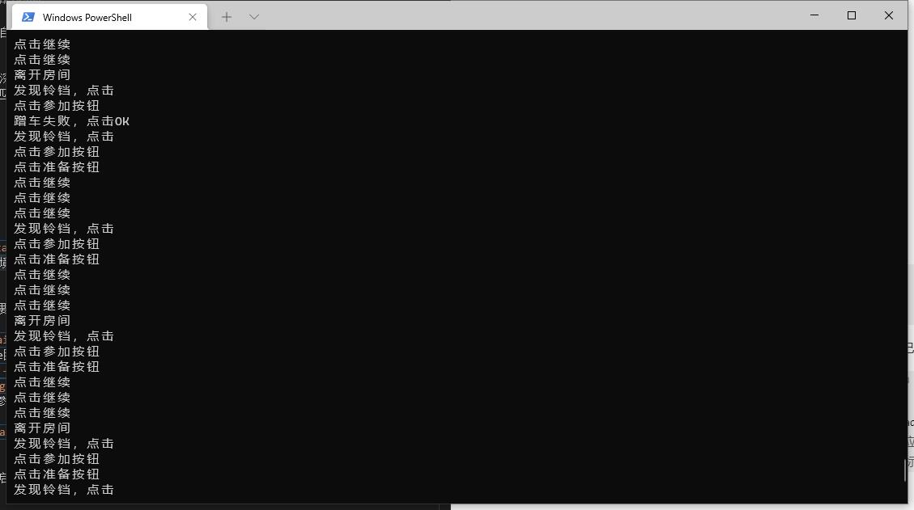

# WFHelper
世界弹射物语护肝宝，24小时自动混铃铛共斗

## Feature
> + 轻量级项目，无需复杂CV库和深度学习库
> + 低开销，图片比对基于pHash匹配，有效提高运行效率，减少计算
> + 兼具高精度和容错率

缺点：无法适配不同分辨率

## Usage

### 运行环境配置

> 1. 安装配置python3环境
> 2. 安装依赖库 `pip install imagehash`
> 3. 安装adb并配置adb到环境变量

### 配置文件

由于该项目泛用性较差，针对分辨率不同的设备，需要为其单独准备配置文件，目前项目中提供了两套自用的配置文件，分别是1440x810分辨率的模拟器配置，以及一加9R手机的配置，可以开箱即用，如果想要在其他分辨率下使用，可以参考`自定义配置文件`

#### 使用已有配置文件
以MUMU手游助手为例：
> 1. 设置模拟器分辨率为1440x810
> 2. 使用`adb connect 127.0.0.1:7555`连接模拟器
> 3. 使用`python \main.py -d 127.0.0.1:7555 -c configs\emulator1440x810\config.json`运行脚本

#### 自定义配置文件
参考给定的两个配置文件目录`emulator1440x810`和`oneplus9r`，将其中的截图替换为自己设备的对应的截图，具体来说
> 1. 首先使用`adb`连接自己的设备
> 2. 使用命令`python .\main.py -s path\of\picture.png`进行截图
> 3. 完成截图后在截图所在目录下新建`config.json`文件，并参考已有配置添加数据，其中`path`为截图的名称，`area`为想要点击的按钮在截图中的范围，分别为左上角x,y和右下角x,y，`text`为点击这个按钮时系统打印的文字信息
> 4. 需要注意config文件必须和截图文件放在同一目录下

由于脚本的原理就是不停截图，判断是否目标区域是否出现了目标图片，然后进行点击，因此可以自行设计config来完成自己所需的任务，如好友开房，小号开灵车等等，而且适用于其他游戏。但是如果想要设计更加复杂的逻辑的话目前无法实现，比如点完某个按钮后必须要去点其他某个位置。

### 运行脚本

对于1440*810的模拟器，完成运行环境配置后并连接`adb`后输入`python .\main.py`即可开始挂机

#### 参数说明
脚本提供了一些可配置的参数设置：
> 1. 当连接多个设备时使用`-d`参数来指定设备名称，设备名称可以通过`adb devices`获取，如`python .\main.py -d 127.0.0.1:7555`
> 2. 想要使用不同配置文件时，可以用`-c`参数指定配置文件路径，如`python .\main.py -c configs\emulator1440x810\config.json`，若不指定配置文件，默认的配置文件为`configs\emulator1440x810\config.json`，可以在`Config.py`中修改默认值
> 3. 本工具提供了截图功能，使用`-s`参数可以进行截图并直接保存到电脑，如`python .\main.py -s C:\Users\Admin\Desktop\test.png`

## 已知问题

使用过程中有任何问题或者有更好的想法欢迎提issue或者其他方式联系我！！！

### 不同设备截图

该项目截图使用`adb shell screencap -p`并直接读取输出的二进制数据，但是发现直接读到的数据由于回车符的存在而无法直接被识别为图片，因此需要进行替换，对于一加9R，替换方式为将`\r\n`替换为`\n`，而对于模拟器替换方式则是`\r\r\n`替换为`\n`，不清楚会不会有其他的情况存在，所以目前的解决办法是两种都试试。

### MUMU多开

MUMU手游助手玩arm64游戏的时候使用的是标准引擎，游戏多开在同一引擎内进行，也就是说使用adb截图的话只能截图到其中一个，而且adb的地址和端口都是`127.0.0.1:7555`，无法区分不同客户端，所以目前无法实现同一模拟器同时挂两个脚本的功能，一个解决方法是放弃adb截图和点击控制，暂时没空搞这个。

## 效果如图
